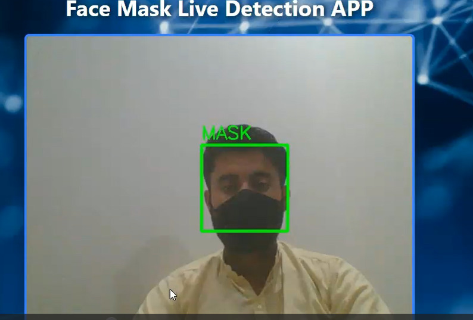
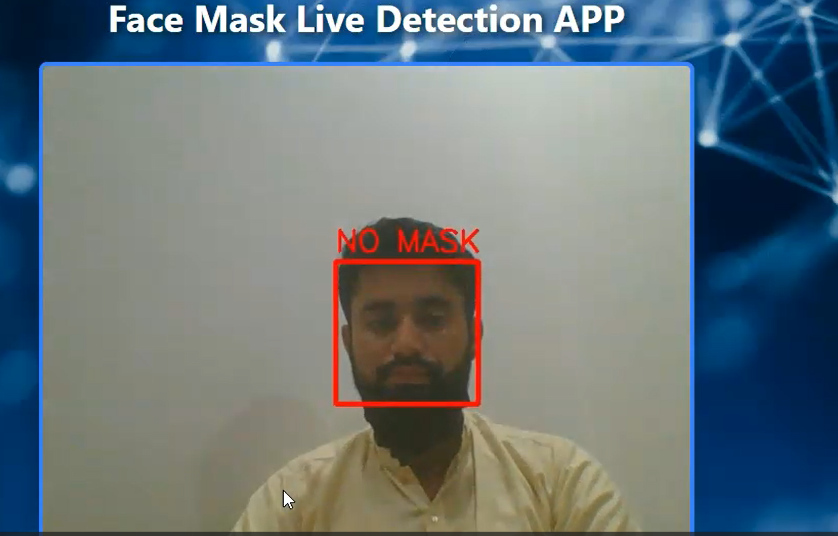

# Face Mask Detection Web Application


## Overview
This web app uses a Convolutional Neural Network (CNN) to detect face mask usage in real-time via a video feed. Built using **Python** and **Django**, the app classifies whether a person is wearing a mask or not, providing instant feedback on the webpage.

## Features
- Real-time detection of face masks using a live video feed.
- Displays results dynamically for mask and no-mask conditions.
- User-friendly interface with clear visual feedback.




## Tech Stack
- **Backend**: Python, Django
- **Frontend**: HTML, CSS, JavaScript
- **Machine Learning**: CNN model for image classification

## Installation
1. Clone the repository:
   ```bash
   git clone https://github.com/username/repo-name.git